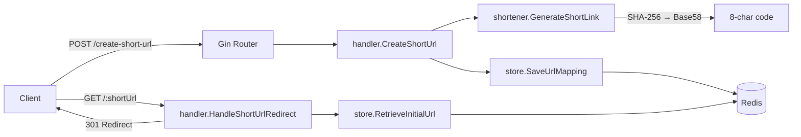

# Go URL Shortener

A minimalist URL shortener written in Go — turn long links into short, shareable ones with a single HTTP call and a 301 redirect on the other side.

**Go 1.26 · Gin · Redis · Base58**

## How it works

1. You `POST` your long URL (plus a user ID) to `/create-short-url`.
2. The shortener hashes the URL + user ID with **SHA-256**, converts the digest to a number, and encodes it as **Base58** — yielding an 8-character short code (`jTa4L57P`, `d66yfx7N`).
3. The `shortCode → originalURL` mapping is stored in **Redis** with a 6-hour TTL.
4. Visiting `GET /:shortUrl` looks up the code and issues a **301 (permanent) redirect** to the original URL.

Because the code is derived from a hash of the input, the same URL + user ID always produces the same short link — no duplicate rows.

## Features

| Feature | Description |
|---|---|
| Short link generation | 8-character Base58 codes via SHA-256 + Base58 encoding |
| Deterministic mapping | Same URL + user ID → same short code |
| Redis-backed storage | Mappings stored in Redis with a 6-hour expiry |
| Permanent redirects | `GET /:shortUrl` responds with HTTP 301 + `Location` header |
| Dockerized Redis | `docker-compose.yaml` with persistence & healthcheck |
| Unit tests | Deterministic generator tests + store round-trip tests (`testify`) |

## Architecture



| Component | Package | Responsibility |
|---|---|---|
| HTTP server | `main` | Gin router, route wiring, listens on `:9808` |
| Handlers | `handler` | Request parsing, JSON binding, redirect logic |
| Shortener | `shortener` | SHA-256 → integer → Base58 → 8-char code |
| Store | `store` | Redis client lifecycle, save/retrieve mappings |

## Repo structure

```
go-url-shortener/
├── main.go                        # entry point — routes, server bootstrap
├── handler/
│   └── handlers.go                # POST /create-short-url, GET /:shortUrl
├── shortener/
│   ├── shorturl_generator.go      # hash + base58 encoding logic
│   └── shorturl_generator_test.go # deterministic-output tests
├── store/
│   ├── store_service.go           # Redis client, save & retrieve mappings
│   └── store_service_test.go      # round-trip tests (require live Redis)
├── docker-compose.yaml            # Redis 6.2 with AOF persistence
├── go.mod / go.sum
└── .gitignore
```

## Getting started

**Prerequisites**

- [Go](https://go.dev/dl/) 1.26+
- [Docker](https://www.docker.com/) (for Redis — or run Redis locally on `:6379`)

**1. Start Redis**

```bash
docker compose up -d
```

**2. Run the server**

```bash
go run main.go
```

The server starts on `http://localhost:9808`.

## Usage

**Create a short link**

```bash
curl -X POST http://localhost:9808/create-short-url \
  -H "Content-Type: application/json" \
  -d '{
    "long_url": "https://github.com/Chisa-Sichali",
    "user_id": "e0dba740-fc4b-4977-872c-d360239e6b1a"
  }'
```

Response:

```json
{
  "message": "Short URL created successfully",
  "short_url": "http://localhost:9808/hb3yRf9Q"
}
```

**Follow the redirect**

```bash
curl -I http://localhost:9808/hb3yRf9Q
```

```http
HTTP/1.1 301 Moved Permanently
Location: https://github.com/Chisa-Sichali
```

## API reference

| Method | Path | Body | Description |
|---|---|---|---|
| `GET` | `/` | — | Health/welcome check |
| `POST` | `/create-short-url` | `{"long_url": string, "user_id": string}` | Creates a short link, returns the full short URL |
| `GET` | `/:shortUrl` | — | 301-redirects to the original URL |

**Request validation:** both `long_url` and `user_id` are required — a missing field returns `400 Bad Request`.

## Configuration

Configuration is currently **hardcoded** in the source:

| Setting | Value | Location |
|---|---|---|
| Server port | `9808` | `main.go` |
| Redis address | `localhost:6379` (DB 0, no password) | `store/store_service.go` |
| Mapping TTL | `6h` | `store/store_service.go` |
| Response host | `http://localhost:9808/` | `handler/handlers.go` |

> Moving these to environment variables is the first item on the roadmap — see below.

## Testing

```bash
go test ./...
```

- `shortener` tests run standalone (pure functions, no dependencies).
- `store` tests require a **live Redis** — run `docker compose up -d` first. The test suite skips nothing and will panic if Redis is unreachable, so start it before running `go test ./...`.
